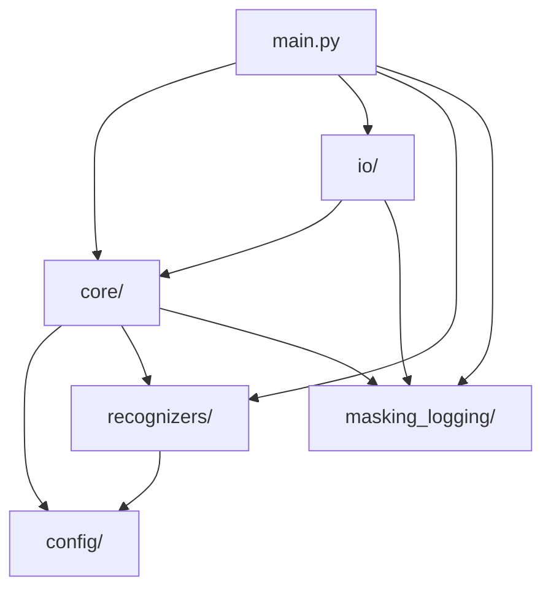

# PDF Masking - Architecture Documentation

## Overview

This project masks PII (Personal Identifiable Information) in PDF and Word documents.
It supports both English and Japanese text.

## Target PII Types (8)

| Entity Type | Japanese | Entity Code |
|-------------|----------|-------------|
| Name | 名前 | `JP_PERSON`, `PERSON` |
| Email | メールアドレス | `EMAIL_ADDRESS` |
| Zip Code | 郵便番号 | `JP_ZIP_CODE` |
| Phone | 電話番号 | `PHONE_NUMBER_JP` |
| Birth Date | 生年月日 | `DATE_OF_BIRTH_JP` |
| Address | 住所 | `JP_ADDRESS`, `LOCATION` |
| Gender | 性別 | `JP_GENDER` |
| Age | 年齢 | `JP_AGE` |

## Directory Structure

```
pdfmasking/
├── main.py                    # CLI entry point
├── config.yaml                # Configuration file
│
├── config/                    # Configuration loading
│   ├── __init__.py
│   └── loader.py              # load_config, get_transformer_config, etc.
│
├── core/                      # Core masking logic
│   ├── __init__.py
│   ├── masker.py              # PIIMasker class, mask_pii_in_text
│   ├── analyzer.py            # create_analyzer, create_multilingual_analyzer
│   └── processors/
│       ├── __init__.py
│       ├── text.py            # preprocess_text
│       ├── result.py          # deduplicate_results, merge_results
│       └── dual_detection.py  # dual_detection_analyze
│
├── file_io/                        # File I/O
│   ├── __init__.py
│   ├── extractors.py          # extract_text (PDF/Word)
│   └── file_processor.py      # process_file
│
├── masking_logging/           # Logging utilities
│   ├── __init__.py
│   └── masking_logger.py      # MaskingLogger class
│
├── recognizers/               # PII recognizers
│   ├── __init__.py
│   ├── registry.py            # RecognizerRegistry, create_default_registry
│   ├── japanese_patterns.py   # Pattern-based recognizers
│   ├── japanese_ner.py        # GiNZA NER recognizers
│   └── transformer_ner.py     # Transformer NER recognizers
│
└── tests/                     # Test suite
    ├── test_japanese_patterns.py
    ├── test_log_output.py
    ├── test_recognizer_registry.py
    └── test_transformer_ner.py
```

## Module Dependencies



## Key Components

### config/loader.py
- `load_config()`: Load config.yaml
- `get_transformer_config()`: Get Transformer settings
- `get_entities_to_mask()`: Get target entity types
- `get_entity_categories()`: Get entity category mappings

### core/masker.py
- `PIIMasker`: Main class for PII masking
- `mask_pii_in_text()`: Function-based API for masking

### core/analyzer.py
- `create_analyzer()`: Create single-language analyzer
- `create_multilingual_analyzer()`: Create en+ja analyzer
- `create_japanese_analyzer()`: Create Japanese-specific analyzer

### core/processors/
- `text.py`: Text preprocessing for PDF-extracted text
- `result.py`: Deduplication and merging of detection results
- `dual_detection.py`: Pattern + Transformer consensus logic

### recognizers/registry.py
- `RecognizerRegistry`: Centralized recognizer management
- `RecognizerConfig`: Recognizer metadata
- `create_default_registry()`: Factory for default recognizers

### io/
- `extractors.py`: PDF and Word text extraction
- `file_processor.py`: Single file processing logic

## Detection Modes

### Standard Mode
Uses pattern-based recognizers for Japanese-specific patterns.

### Dual Detection Mode
When `transformer.require_dual_detection: true` in config.yaml:
1. Runs pattern-based analysis
2. Runs Transformer-based analysis
3. Only masks entities detected by BOTH

This reduces false positives for name/address entities.
