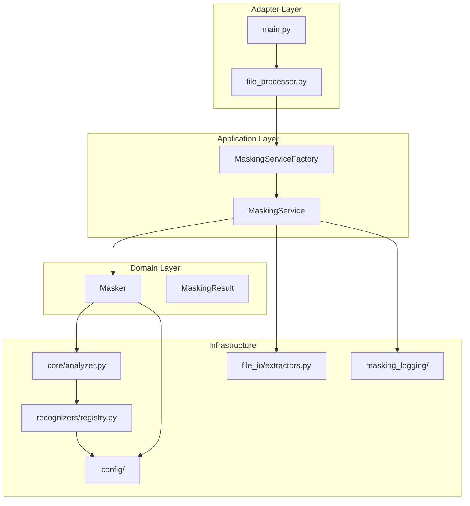
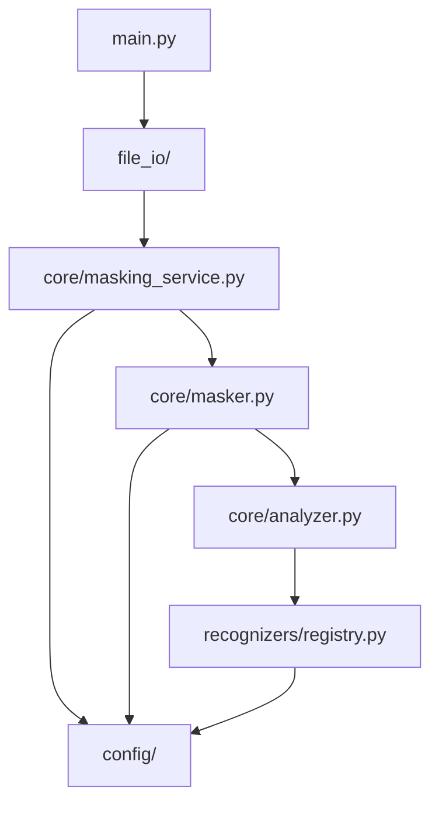

# PDF Masking - Architecture Documentation

## Overview

This project masks PII (Personal Identifiable Information) in PDF and Word documents.
It supports both English and Japanese text.

## Architecture Principles

### Dependency Injection (DI)

The system uses DI for the Domain and Application layers:

- **Domain Layer (`core/masker.py`)**: `Masker` class accepts dependencies via constructor
- **Application Layer (`core/masking_service.py`)**: `MaskingService` orchestrates the workflow
- **Infrastructure Layer**: Recognizers, extractors can be directly instantiated

### Single Source of Truth

- **Configuration**: All config loading through `config/` package
- **Analyzer Factory**: All analyzer creation through `core/analyzer.py`
- **Recognizer Registry**: All recognizer management through `recognizers/registry.py`

## Target PII Types

| Entity Type | Japanese | Entity Code |
|-------------|----------|-------------|
| Name | 名前 | `JP_PERSON`, `PERSON` |
| Email | メールアドレス | `EMAIL_ADDRESS` |
| Zip Code | 郵便番号 | `JP_ZIP_CODE` |
| Phone | 電話番号 | `PHONE_NUMBER_JP` |
| Birth Date | 生年月日 | `DATE_OF_BIRTH_JP` |
| Address | 住所 | `JP_ADDRESS`, `LOCATION` |

In practice we also support (config-driven):

- `JP_AGE` (年齢)
- `JP_GENDER` (性別)
- `JP_ORGANIZATION` (組織名)
- `CUSTOMER_ID_JP` (顧客ID)


## Directory Structure

```
pdfmasking/
├── main.py                    # CLI entry point
├── config.yaml                # Configuration file
│
├── config/                    # Configuration (Single Source of Truth)
│   ├── __init__.py            # Re-exports load_config, get_*
│   └── loader.py              # load_config, get_transformer_config, etc.
│
├── core/                      # Domain + Application Layer (DI-enabled)
│   ├── __init__.py
│   ├── masker.py              # Masker class (Domain Layer)
│   ├── masking_service.py     # MaskingService, MaskingServiceFactory (Application Layer)
│   ├── masking_result.py      # MaskingResult dataclass
│   ├── analyzer.py            # create_analyzer, create_multilingual_analyzer
│   ├── protocols.py           # LoggerProtocol, TextExtractorProtocol, etc.
│   └── processors/
│       ├── __init__.py
│       ├── text.py            # preprocess_text, TextPreprocessor
│       ├── result.py          # deduplicate_results, merge_results
│       └── hybrid_detection.py # Hybrid detection logic
│
├── file_io/                   # Adapter Layer
│   ├── __init__.py
│   ├── extractors.py          # TextExtractor (PDF/Word extraction)
│   └── file_processor.py      # Thin adapter → MaskingServiceFactory.create()
│
├── masking_logging/           # Logging utilities
│   ├── __init__.py
│   └── masking_logger.py      # MaskingLogger class
│
├── recognizers/               # PII recognizers
│   ├── __init__.py
│   ├── registry.py            # RecognizerRegistry, create_default_registry
│   ├── japanese_patterns.py   # Pattern-based recognizers
│   ├── japanese_ner.py        # GiNZA NER recognizers
│   ├── gpt_pii_masker.py       # GPT PII masker (CausalLM, span recovery)
│   └── transformer_ner.py     # Transformer NER recognizers
│
├── model_registry.py          # ModelRegistry for config-driven ML model management
│
└── tests/                     # Test suite
    ├── unit/
    ├── integration/
    └── accuracy/
```

## Layer Architecture



## Module Dependencies



## Key Components

### config/loader.py

Configuration loading (Single Source of Truth):

- `load_config()`: Load config.yaml
- `get_transformer_config()`: Get Transformer settings (includes models_registry, models_defaults)
- `get_detection_strategy()`: Get entity routing strategy
- `get_entities_to_mask()`: Get target entity types
- `get_entity_categories()`: Get entity category mappings

### core/masker.py

Domain layer with Dependency Injection:

```python
class Masker:
    def __init__(
        self,
        anonymizer: AnonymizerProtocol | None = None,
        logger: LoggerProtocol | None = None,
        config: dict[str, Any] | None = None
    ):
        ...
    
    def analyze(self, text: str, language: str = "auto") -> list:
        ...
    
    def mask(self, text: str, language: str = "auto") -> MaskingResult:
        ...
```

### core/masking_service.py

Application layer for file-based processing:

```python
class MaskingService:
    def __init__(self, extractor, masker, logger):
        ...
    
    def process_file(self, input_path, output_path, log_path, language, verbose) -> MaskingResult:
        ...

class MaskingServiceFactory:
    @staticmethod
    def create(config=None, use_preprocessor=False, use_ner=False) -> MaskingService:
        ...
```

### core/analyzer.py

Analyzer factory functions:

- `create_analyzer(language)`: Create single-language analyzer
- `create_multilingual_analyzer()`: Create en+ja analyzer
- `create_japanese_analyzer()`: Create Japanese-specific analyzer

### recognizers/registry.py

Recognizer management:

- `RecognizerRegistry`: Centralized recognizer management
- `RecognizerConfig`: Recognizer metadata (type, language, entity_type)
- `create_default_registry()`: Factory for default recognizers

### file_io/file_processor.py

Thin adapter that delegates to MaskingService:

```python
def process_file(input_path, output_path, log_path, language, verbose, use_preprocessor, use_ner):
    service = MaskingServiceFactory.create(use_preprocessor=use_preprocessor, use_ner=use_ner)
    service.process_file(input_path, output_path, log_path, language, verbose)
```

## Detection Modes

### Standard Mode

Uses pattern-based recognizers for Japanese-specific patterns.

### Hybrid Detection Mode

When `transformer.enabled: true` in config.yaml:
1. Pattern/GiNZA recognizers handle rule/NER-based entities.
2. One ML recognizer is enabled based on `models.defaults.<lang>`:
    - `type: transformer` → Transformer NER (TokenClassification)
    - `type: gpt_pii_masker` → GPT PII Masker (CausalLM)

Note: the config key is historically named `transformer.enabled`, but it gates the whole “ML path” (including GPT).

### Dual Detection Mode

When `transformer.require_dual_detection: true`:
1. Runs pattern-based analysis
2. Runs Transformer-based analysis
3. Only masks entities detected by BOTH

This reduces false positives for name/address entities.

### GPT PII Masker Notes (CausalLM)

The GPT masker produces a tagged (masked) output and then performs **span recovery** to map each tagged item back to a `(start, end)` span in the original text.

Design constraints:

- Presidio integration requires `(start, end)` → span recovery is mandatory
- If span recovery is ambiguous or fails, the candidate is discarded (fail-closed)
- Discard reasons are logged via the `masking` logger

Operational notes:

- The model is loaded lazily (to keep unit tests/light runs fast)
- GPU is assumed for production; see `gpt_masker.require_gpu` in `config.yaml`

### PDF Extraction Noise Guard

PDF text extraction sometimes yields stray tokens (e.g., punctuation/decoration) which NER may misclassify as persons.
We apply a best-effort filter in `core/masker.py` to drop obviously non-meaningful `JP_PERSON/PERSON` entities.

## Usage Examples

### Using MaskingService (Recommended)

```python
from core.masking_service import MaskingServiceFactory

service = MaskingServiceFactory.create()
result = service.process_file(
    input_path=Path("document.pdf"),
    output_path=Path("output/masked.txt"),
    log_path=Path("output/log.txt"),
    language="ja",
    verbose=True
)
```

### Using Masker Directly

```python
from core.masker import Masker
from presidio_anonymizer import AnonymizerEngine
from config import load_config

masker = Masker(
    anonymizer=AnonymizerEngine(),
    config=load_config()
)
result = masker.mask("山田太郎、電話：090-1234-5678", language="ja")
print(result.masked_text)
```

### Using Analyzer

```python
from core.analyzer import create_analyzer

analyzer = create_analyzer(language="ja")
results = analyzer.analyze(text, language="ja", entities=["JP_PERSON", "PHONE_NUMBER_JP"])
```
